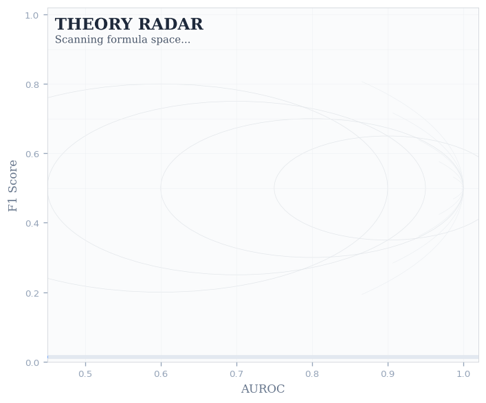
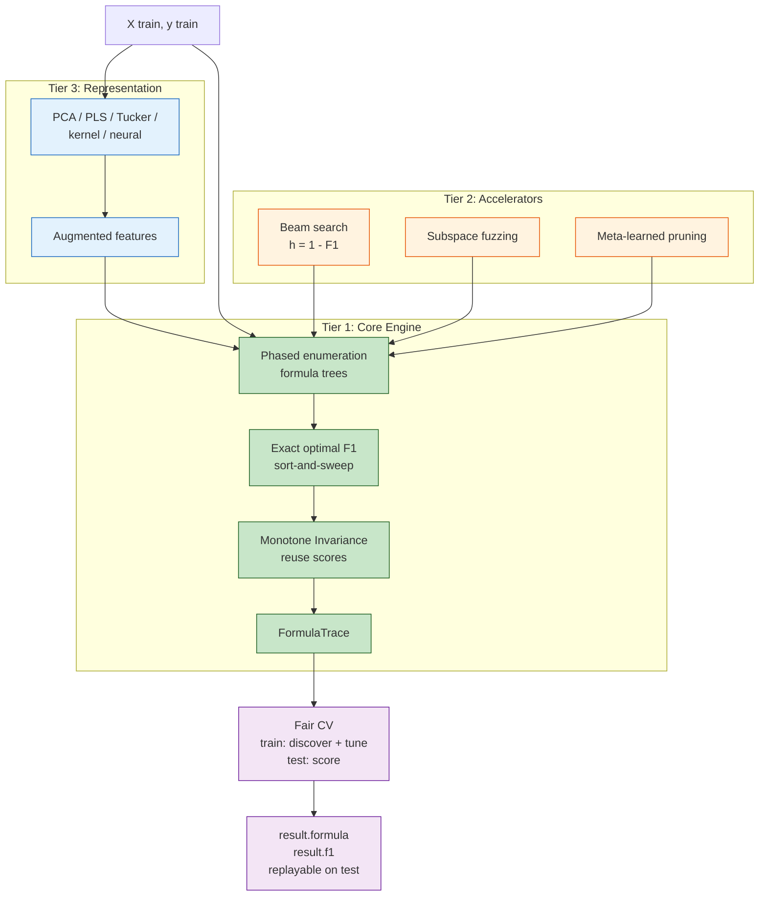

<h1 align="center">Theory Radar</h1>

<p align="center">
  <em>Do you need a black box, or would a formula suffice?</em>
</p>

<p align="center">
  
</p>

<p align="center">
  <a href="https://pypi.org/project/theory-radar/"></a>
  <a href="https://github.com/ahb-sjsu/theory-radar/actions"></a>
  
  
</p>

---

Theory Radar discovers interpretable symbolic classifiers from tabular data and tells you whether they can replace an ensemble on your specific dataset.

On Pima Diabetes, a three-feature formula `min(insulin, age) + glucose` **beats gradient boosting at 25σ** significance with fair held-out evaluation across 1000 folds. On Breast Cancer, PCA-projected formulas come within 6σ of gradient boosting by accessing all 30 features through learned projections. On EEG (N=15K), ensembles win decisively — and Theory Radar reports that honestly. The tool's value is in the comparison, not in always winning.

```python
from symbolic_search import TheoryRadar

radar = TheoryRadar(X_train, y_train, projection="pca")
result = radar.search(mode="fast")
print(result.formula)  # "(f19 - pc0) + f5"
print(result.f1)       # 0.963
```

Or let it find the best configuration automatically:

```python
radar, result = TheoryRadar.autotune(X_train, y_train, max_time=120)
```

## Three-Tier Architecture

Theory Radar is a complete search stack, not a one-off script.



### Tier 1: Core Engine

The foundation. Produces valid, fair results on its own.

- **Phased enumeration** of all formula trees to a given depth
- **Exact optimal F1** via sort-and-sweep over all N thresholds, O(N log N)
- **Monotone Invariance Theorem**: monotone transforms preserve F1 and AUROC (proved), enabling evaluation reuse
- **FormulaTrace**: records the operation sequence so formulas can be replayed on test data
- **Fair CV evaluation**: formula discovered on train, threshold tuned on train, scored on test—identical to sklearn baselines

### Tier 2: Search Accelerators

Optional components that make the search faster and more thorough.

- **Beam search** with cost-plus-heuristic ordering (h = 1 - F1 for alive nodes)
- **Subspace fuzzing**: random feature subsets for broader exploration
- **Meta-learned pruning**: the search discovers its own pruning rules from exhaustive fold-local micro-search. 88-99.6% of dead subtrees pruned with zero false negatives.

### Tier 3: Representation Augmenters

Projections that give depth-3 formulas implicit access to ALL features.

| Projection | What it captures | When to use |
|-----------|-----------------|-------------|
| `"pca"` | Linear variance directions | Default for d > 10. Closes gap on BreastCancer (.955 → .963) |
| `"pls"` | Discriminative directions (supervised) | When you want projections that target the class boundary |
| `"tucker"` | Pairwise feature interactions | Tested; PCA outperforms on current benchmarks |
| `"kernel"` | Nonlinear manifold structure | Complex nonlinear boundaries |
| `"neural"` | Learned nonlinear projection | Data-adaptive |

```python
# PCA projections (recommended default)
radar = TheoryRadar(X, y, projection="pca")

# PLS: supervised projections maximizing covariance with y
radar = TheoryRadar(X, y, projection="pls")

# Full stack: projections + fuzzing + meta-pruning
radar = TheoryRadar(X, y,
    projection=["pca", "pls"],
    n_subspaces=10,
    subspace_k=12,
    meta_prune=True,
)
```

## Results

Full pipeline (Tier 1 + 2 + 3), 200×5-fold repeated CV, fair held-out evaluation:

| Dataset | N | d | Test F1 | Formula | vs GB | vs RF | vs LR |
|---------|--:|--:|--------:|---------|-------|-------|-------|
| **Diabetes** | 768 | 8 | .668 | `min(v5,v7) + v1` | **25σ A\*>** | **27σ A\*>** | **21σ A\*>** |
| **Wine** | 178 | 13 | .953 | `min(w6,w0) + w12` | **16σ A\*>** | 18σ RF> | 23σ LR> |
| **Banknote** | 1372 | 4 | .986 | `(v0+v1) + v2` | 26σ GB> | 22σ RF> | **27σ A\*>** |
| **BreastCancer** | 569 | 30 | .963 | `(f19 - pc0) + f5` | 6σ GB> | 10σ RF> | 37σ LR> |
| **EEG** | 14980 | 14 | .655 | `max(v13-v5, v6)` | 246σ GB> | 417σ RF> | **250σ A\*>** |

**Bold** = formula wins. The pattern: when the boundary can be captured by 2-3 features, formulas match or beat ensembles. When it requires many features, ensembles win. Theory Radar quantifies this tradeoff on your specific data.

*Full 17-dataset benchmark (Heart, Sonar, Spambase, German Credit, Australian Credit, Adult, HIGGS, Electricity, MiniBooNE, Magic, Ionosphere, Covertype) in progress.*

### Projection Comparison (BreastCancer)

| Projection | Test F1 | Gap | vs GB σ | Notes |
|-----------|---------|-----|---------|-------|
| raw (no projection) | .955 | .017 | 20.9σ GB> | Baseline |
| PCA (8 components) | .963 | .013 | 6.0σ GB> | **Best so far** |
| Tucker (HOSVD) | .955 | .017 | 20.9σ GB> | No improvement over raw |
| PLS / combined | — | — | — | *Shootout running* |

PCA projections give formulas implicit access to all features through linear combinations. Tucker decomposition (feature interaction tensor) was tested but did not improve over PCA on current benchmarks.

## Installation

```bash
pip install theory-radar
```

For GPU acceleration:
```bash
pip install theory-radar[gpu]   # adds cupy-cuda12x
```

For all projections:
```bash
pip install theory-radar[all]   # adds scikit-learn, tensorly
```

## Quick Start

### Basic search
```python
from symbolic_search import TheoryRadar

radar = TheoryRadar(X_train, y_train)
result = radar.search(mode="fast", max_depth=3)
print(f"Formula: {result.formula}")
print(f"F1: {result.f1:.4f}")
```

### Fair evaluation on test data
```python
# The formula is recorded as a FormulaTrace
# Replay it on test data with a threshold tuned on train
X_test_aug = radar.transform_test(X_test)
values = result.trace.evaluate(X_test_aug)
threshold, direction, _ = find_optimal_threshold(
    result.trace.evaluate(X_train_aug), y_train)
predictions = (direction * values >= threshold).astype(int)
test_f1 = f1_score(y_test, predictions)
```

### Autotune (find best configuration)
```python
radar, result = TheoryRadar.autotune(X, y, max_time=120)
# Automatically searches projections, depths, subspace sizes
```

### Compare with baselines
```python
from sklearn.ensemble import GradientBoostingClassifier

gb = GradientBoostingClassifier(n_estimators=100)
gb.fit(X_train, y_train)
gb_f1 = f1_score(y_test, gb.predict(X_test))

print(f"Formula: {test_f1:.4f}")
print(f"GB:      {gb_f1:.4f}")
print(f"Gap:     {gb_f1 - test_f1:+.4f}")
```

## API Reference

### `TheoryRadar(X, y, **options)`

| Parameter | Type | Default | Description |
|-----------|------|---------|-------------|
| `X` | ndarray | required | Feature matrix (N, d) |
| `y` | ndarray | required | Binary labels (N,) |
| `feature_names` | list | auto | Names for features |
| `projection` | str/list | None | `"pca"`, `"tucker"`, `"kernel"`, `"neural"`, or list |
| `n_projection_components` | int | 8 | Components per projection |
| `n_subspaces` | int | 1 | Random subspace trials |
| `subspace_k` | int | d | Features per subspace |
| `meta_prune` | bool | False | Enable meta-learned pruning |
| `ensemble_k` | int | 1 | Top-k formula ensemble |
| `validation_fraction` | float | 0.0 | Holdout for beam selection |
| `binary_ops` | dict | 10 ops | Custom binary operations |
| `unary_ops` | dict | 8 ops | Custom unary operations |

### `radar.search(mode, **options)`

| Parameter | Type | Default | Description |
|-----------|------|---------|-------------|
| `mode` | str | `"auto"` | `"strict"`, `"fast"`, or `"auto"` |
| `f1_target` | float | 0.0 | Target F1 (0 = find best) |
| `max_depth` | int | 3 | Maximum formula depth |
| `max_expansions` | int | 50000 | Node budget |
| `auroc_threshold` | float | 0.55 | AUROC pruning threshold (fast mode) |
| `timeout` | float | 300 | Seconds before fallback (auto mode) |

### `TheoryRadar.autotune(X, y, max_time=300)`

Static method. Searches over configurations and returns the best `(radar, result)` tuple.

## How It Works

1. **Enumerate** all formula trees: `x1`, `(x1 + x2)`, `min(x1, x2) + x3`, ...
2. **Evaluate** each by sorting all N samples and finding the threshold that maximizes F1
3. **Keep** the top B formulas at each depth (beam search)
4. **Prune** dead subtrees using meta-learned criteria (zero false negatives)
5. **Project** features via PCA/Tucker/kernel to access all d features in depth-3 formulas
6. **Record** the winning formula's operations for fair test-set replay

## Citation

```bibtex
@article{bond2026theoryradar,
  title={Theory Radar: Learning Safe Pruning Rules for Symbolic Formula
         Search from Exhaustive Micro-Search},
  author={Bond, Andrew H.},
  journal={IEEE Transactions on Artificial Intelligence},
  year={2026},
  note={Under review}
}
```

## Architecture

See [ARCHITECTURE.md](ARCHITECTURE.md) for the full three-tier design document, including theoretical results, what was abandoned (and why), and the experiment plan.

## Related Work

- **batch-probe** ([PyPI](https://pypi.org/project/batch-probe/)): GPU batch size finder + Kalman-filtered thermal CPU management. Used for running Theory Radar experiments with `ThermalJobManager`.
- **Tensor rank and dynamical tractability**: The Tucker/HOSVD methods in Tier 3 originate from research on tensor decomposition for the gravitational 3-body problem.
- **PySR / Cranmer 2023**: Genetic symbolic regression for physics. Theory Radar differs in targeting classification (F1), providing fair evaluation (FormulaTrace), and learning its own pruning rules.
- **InterpretML / EBM**: Microsoft's Explainable Boosting Machines. Interpretable but still complex models with many parameters. Theory Radar formulas are one line of math.

## License

MIT
